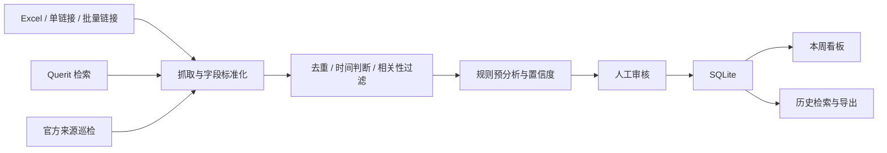

# Querit · 智能竞品监测看板

**把分散在官网、博客、文档和 GitHub 的竞品动态，整理成可追溯、可审核、可行动的每周情报。**

一个使用 Python、Streamlit 和 SQLite 构建的个人作品，面向 AI Search API 领域，跟踪 Tavily、Exa、Brave 等产品，并提供与 Querit 的对照分析工作流。

## 为什么做这个项目

竞品信息分散、更新频繁，单纯收集链接难以回答“本周发生了什么、哪些值得关注、接下来做什么”。这个项目把信息收集、去重、时间判断、辅助分类与人工审核放在同一条流程里，让看板展示经过确认的动态。

## 主要功能

| 模块 | 能力 |
| --- | --- |
| 本周看板 | 按产品与功能、生态与集成、市场与运营分组，支持竞品、优先级和 Querit 状态筛选 |
| 数据导入 | 单链接录入、批量链接、Excel 模板与灵活表头导入，包含重复记录预览与批次记录 |
| 待审核区 | 查看抓取内容和自动分析建议，补充业务意义、差距判断与建议动作，确认或忽略 |
| 历史动态 | 跨周检索、多条件筛选与 Excel 导出 |
| 来源能力测试 | 单链接和批量抓取诊断，区分成功、部分可用、受限和失败来源 |
| Querit 智能检索 | 查询模板、日期窗口、检索结果适配与去重，支持 Mock 模式 |
| 官方来源巡检 | 官网、博客、文档、Sitemap 与 GitHub 的来源发现和下钻，保存巡检历史 |

## 设计亮点

- **保留证据链**：原始链接、抓取状态、时间依据与分析建议可供人工复核。
- **区分首次发现与实际更新**：结合发布日期、时间窗口和文档快照差异，减少把旧内容当作新动态。
- **降低 GitHub 噪声**：对提交、发布和仓库信息进行相关性判断与事件聚合。
- **人工审核闭环**：采集结果先进入待审核区，只有确认后的记录进入正式周看板；重抓取保护已有人工分析。
- **可解释的辅助判断**：基于关键词规则、内容完整度和抓取状态生成分类与置信度。



## 本地运行

推荐使用 **Python 3.12**，在项目根目录执行：

```bash
python3 -m venv .venv
source .venv/bin/activate
# Windows PowerShell: .venv\Scripts\Activate.ps1
python -m pip install -r requirements.txt
cp .env.example .env
# Windows PowerShell: Copy-Item .env.example .env
python -m streamlit run app.py
```

打开 <http://localhost:8501>。启动时自动创建 `data/` 下的 SQLite 数据库并执行迁移。

默认 `QUERIT_MOCK_MODE=true`，无需 API Key 即可体验模拟检索。Excel 导入与人工审核也可独立使用。网站抓取和官方来源巡检仍需要网络。

首次使用可以在“数据导入”下载模板、填写记录，再到“待审核区”确认。只有 `week_id` 属于当前周次且已确认的记录会进入本周看板。检索及巡检导入通常使用收录时的周次，这不等同于原文发布时间。模板中的示例内容用于演示填写格式，不代表经过核实的产品新闻。

### 接入真实 Querit 检索

在本地 `.env` 中设置服务提供方给出的地址、路径与密钥：

```dotenv
QUERIT_MOCK_MODE=false
QUERIT_API_BASE_URL=https://your-api-host.example
QUERIT_API_SEARCH_PATH=/search
QUERIT_API_KEY=your-key-here
QUERIT_API_TIMEOUT=30
QUERIT_API_MAX_RETRIES=1
```

地址仅为占位示例。客户端使用 Bearer 鉴权，具体接口需与实际 Querit 服务匹配。

### 命令行巡检

```bash
python scripts/run_official_monitor.py \
  --competitor Tavily \
  --start-date 2026-09-01 \
  --end-date 2026-09-07 \
  --sources all \
  --disable-querit-supplement
```

命令用于运行巡检并打印结果；正式看板的入库审核在界面中完成。

## 项目结构

```text
.
├── app.py                 # Streamlit 入口、环境加载与数据库初始化
├── config.py              # 路径、枚举与字段映射
├── database.py            # 数据存取与迁移
├── env_loader.py          # 环境变量加载
├── pages/                 # 七个功能页面
├── services/              # 检索、抓取、分析、去重与审核服务
├── config/                # 来源清单、查询模板与评测配置
├── scripts/               # 巡检、迁移和诊断工具
├── templates/             # Excel 导入模板
├── tests/                 # 自动化测试与测试夹具
└── docs/                  # 补充文档
```

## 测试

已在 Python 3.12 环境验证：**774 项测试全部通过**。测试默认使用临时数据库，不依赖私人运行数据。

```bash
python -m pytest tests/ -q
```

测试覆盖数据存取、导入、去重、日期解析、来源抓取、审核字段保护、巡检与页面编译等行为。真实第三方来源的可用性还取决于网络、页面结构和访问限制。

## 当前边界

- 当前自动预分析主要为规则与模板逻辑，不能替代人工事实核查。
- GitHub 事件合成默认使用 Mock provider；OpenAI / Anthropic provider 仅预留接口，尚未实现真实模型调用。
- 这是本地运行的作品原型，未提供多用户登录与权限管理。GitHub 仓库展示源码，运行交互看板需要 Python 服务。
- 公开版本不包含 API 密钥、私人运行数据库、抓取缓存、虚拟环境和编辑器会话。

初始版本的使用说明保存在 [原始 README](docs/original-readme.md)，其中“下一步”描述属于历史规划；当前能力以本页及源码为准。

## 更多展示资料

- [产品设计](docs/product-design.md)
- [架构说明](docs/architecture.md)
- [示例输出](demo/sample_dashboard.md)
- [源码核验与展示修订记录](docs/source-audit.md)
