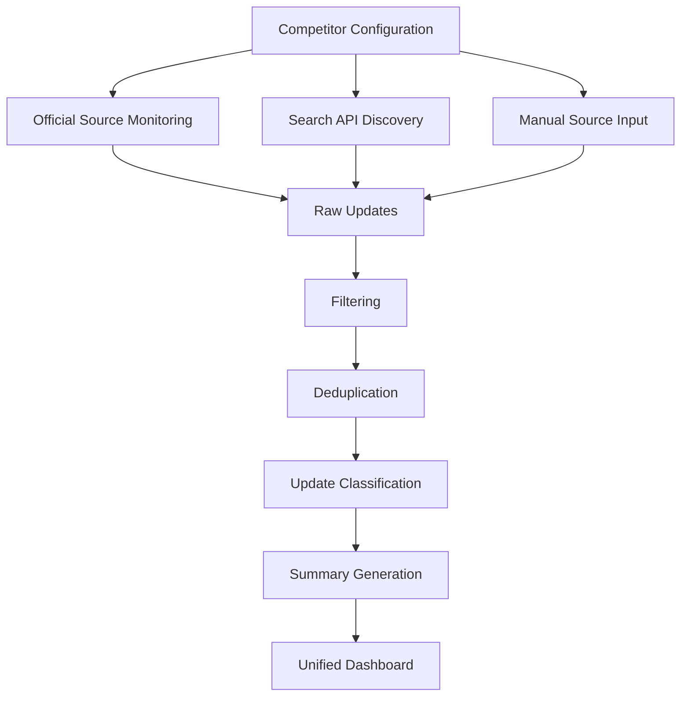

# System Architecture

## Overview

The AI Search Competitor Monitor is a monitoring dashboard designed to track public updates across AI Search API competitors.

The system combines three information discovery paths:

1. Official-source monitoring
2. Search API-based discovery
3. Manual supplementation for sources that are difficult to access automatically

The goal is to reduce missed updates caused by relying only on keyword search, while keeping the monitoring workflow structured and reviewable.

---

## High-Level Architecture



---

## 1. Competitor Configuration

The system maintains monitoring configurations for each competitor.

Configuration may include:

- Competitor name
- Official website
- Blog or changelog pages
- Documentation pages
- GitHub repositories
- Monitoring keywords
- Search queries
- Time window

Different competitors can use different monitoring configurations depending on their public information structure.

---

## 2. Official Source Monitoring

Official-source monitoring is used as the primary discovery path.

Typical sources include:

- Official websites
- Product blogs
- Changelogs
- Documentation
- GitHub repositories

The system checks these sources for newly published or updated public content.

This path is designed to improve coverage compared with relying only on general-purpose keyword search.

---

## 3. Search API Discovery

Search API retrieval is used as a supplementary discovery method.

It is mainly used to identify updates that may not be directly captured through the predefined official-source list.

Queries can be adjusted based on:

- Competitor
- Source type
- Update category
- Date range
- Monitoring objective

Search results are then passed into the same downstream processing pipeline.

---

## 4. Manual Source Input

Some sources are difficult to monitor automatically because of platform access limitations or unstable page structures.

For these sources, relevant public URLs can be added manually.

Typical examples include:

- Social media posts
- Community discussions
- Event pages
- Partnership announcements

Manually added URLs are processed together with automatically discovered results so that all updates can be reviewed in one place.

---

## 5. Filtering and Deduplication

Raw monitoring results may contain irrelevant, repeated, or overlapping information.

The processing layer performs:

- Relevance filtering
- Date filtering
- Source validation
- Duplicate removal
- Similar-update consolidation

This step reduces noise before updates are displayed in the dashboard.

---

## 6. Update Classification

Relevant updates are categorized into structured monitoring dimensions.

Typical categories include:

- Product updates
- API and documentation changes
- GitHub activity
- Ecosystem integrations
- Partnerships
- Events
- Use cases
- Benchmarks

Structured classification makes weekly review and cross-competitor comparison easier.

---

## 7. Summary and Dashboard

Processed updates are summarized and displayed in a unified dashboard.

The dashboard is designed to support:

- Competitor-level review
- Source-level review
- Category filtering
- Time-window filtering
- Weekly update aggregation

The final output is intended to make competitor changes easier to review without repeatedly checking each source manually.

---

## Monitoring Strategy

The final monitoring strategy can be summarized as:

```text
Official Source Monitoring
        +
Search API Discovery
        +
Manual Supplementation
        ↓
Filtering & Deduplication
        ↓
Classification & Summary
        ↓
Unified Dashboard
```

The three discovery paths are complementary rather than interchangeable.

Official sources provide higher-confidence updates, Search API retrieval improves discovery coverage, and manual supplementation handles sources that are difficult to automate.

---

## Repository Scope

This repository presents a sanitized reconstruction of the project architecture.

It does not expose proprietary code, internal infrastructure, private business data, credentials, or non-public information.
