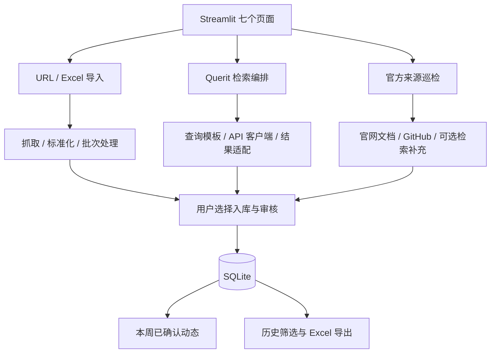

# 架构说明（按源码核验）

## 技术栈与启动

Python 3.12、Streamlit 1.35、SQLite、Pandas、OpenPyXL、Requests、Beautiful Soup、PyYAML；依赖版本见 `requirements.txt`。

`app.py` 先通过 `env_loader.load_env()` 加载本地 `.env`，再调用 `database.init_db()` 与 `database.run_migrations()`。Streamlit 通过 `pages/` 自动发现七个中文页面。

## 模块与数据流

这是概念图，三条入口并非执行完全相同的处理步骤。

| 层 | 主要源码 | 职责 |
| --- | --- | --- |
| 界面 | `app.py`、`pages/` | 筛选、预览、巡检触发、入库确认、人工审核 |
| 手工导入 | `excel_importer.py`、`flexible_excel_importer.py`、`import_batch_service.py` | 表格解析、URL 批处理、批次记录与重复预览 |
| 检索 | `querit_query_builder.py`、`querit_client.py`、`querit_retrieval_orchestrator.py`、`querit_result_adapter.py` | 英文查询、Mock/真实 HTTP 检索、结果标准化 |
| 官方巡检 | `official_source_monitor.py`、`website_monitor.py`、`github_monitor.py` | 来源配置、官网/文档/GitHub 采集、结果合并 |
| 质量处理 | `freshness_filter.py`、`publish_date_parser.py`、`competitor_relevance_filter.py`、`url_normalizer.py` | 日期、来源、相关性与 URL 去重 |
| 文档变化 | `docs_change_detector.py`、`docs_snapshot_store.py` | 页面快照和变化判断 |
| 辅助分析 | `content_analyzer.py`、`classification_rules.py`、`github_event_synthesizer.py` | 规则分类、置信度和默认 Mock 事件合成 |
| 持久化 | `database.py`、`monitor_run_store.py`、`data_service.py` | SQLite CRUD、迁移、审核与查询 |

表中省略前缀的服务文件均位于 `services/`。

## SQLite 数据模型

`database.py` 定义七张主要表，并通过迁移增加扩展字段：

| 表 | 用途 |
| --- | --- |
| `competitor_updates` | 正式记录、人工审核状态与分析字段 |
| `import_batches` | 手工导入批次统计 |
| `querit_search_runs` | 检索执行批次 |
| `querit_search_queries` | 每次执行中的查询 |
| `querit_search_results` | 检索候选及时间窗口等信息 |
| `official_source_snapshots` | 官方页面快照及首次发现、更新状态 |
| `official_monitor_runs` | 巡检历史与结果序列化 |

运行数据写入 `data/competitor_dashboard.db`，该目录不纳入 Git。`models.py` 中的 dataclass 只表示核心字段，不是全部迁移后数据库字段的完整模型。

## 三种不同的时间

- **来源时间**：文章/页面/提交本身的发布或更新时间。
- **发现与采集时间**：系统第一次看到或本次收录该内容的时间。
- **看板周次**：记录的 `week_id`；检索与官方巡检导入使用当时的当前周次。

`get_weekly_dashboard()` 使用当前周次和 `已确认` 状态查询。来源时间的窗口判断发生在相应检索或巡检管线中，不能将二者等同。

## 外部服务边界

Querit 客户端从环境变量读取 URL、路径和 Bearer Key，默认可使用 Mock。公开 GitHub 抓取支持匿名请求，可能受限流影响。真实网页抓取依赖网络、页面结构和来源访问策略。

OpenAI / Anthropic 事件合成 provider 只是占位实现，配置密钥不会使其自动可用。系统没有后台调度器；也未实现生产部署所需的多用户认证与权限管理。

## 验证

本次在 Python 3.12、`requirements.txt` 指定依赖下运行 `python -m pytest tests/ -q`：774 项通过，并验证 Streamlit 首页及七个功能页初始运行。新增测试会话夹具使用临时 SQLite 数据库，以支持不携带私人 `data/` 的全新克隆。
