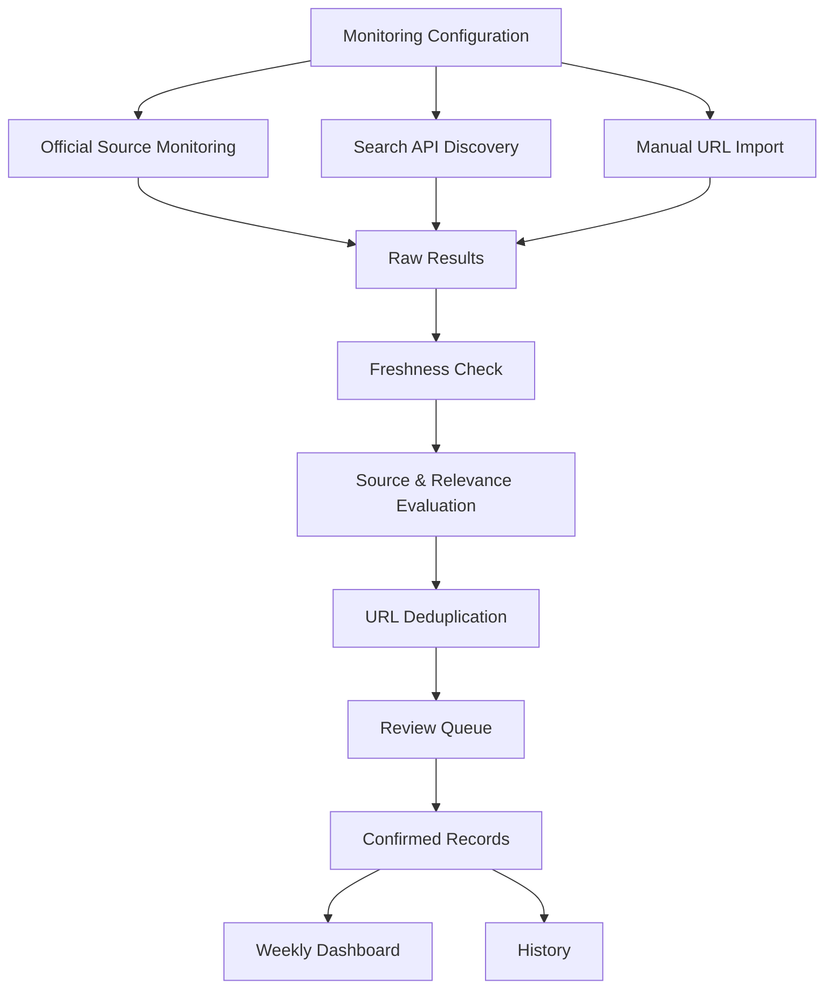

# System Architecture

## Overview

The AI Search Competitor Monitor is an independent monitoring dashboard designed for recurring research on AI Search API competitors.

The system separates information discovery into three paths:

1. Official-source monitoring
2. Search API discovery
3. Manual URL input

All discovered records then enter a shared processing and review workflow.

---

## High-Level Architecture



---

## 1. Monitoring Configuration

Monitoring behavior is configured by competitor, source scope, and time window.

The project contains competitor-specific configurations for sources such as:

- Official domains
- Documentation domains
- GitHub organizations and repositories
- Official social accounts
- Event domains
- Selected partner domains
- Excluded low-value domains

The main competitors used during development were Tavily, Exa, and Brave Search.

---

## 2. Official Source Monitoring

Official-source monitoring handles structured first-party sources.

### Entry-page Detection

Some URLs are treated as entry pages rather than final update records.

Examples include:

- Blog index pages
- Documentation index pages
- GitHub repositories

Entry pages are not directly imported as competitor updates.

### Drill-down

The system drills down from entry pages to specific content.

Examples tested during development include:

```text
Blog Index
    ↓
Individual Blog Articles
```

```text
Documentation Index
    ↓
Documentation Pages
```

```text
GitHub Repository
    ↓
Commits / Releases
```

For documentation pages, sitemap metadata can be used to identify update timestamps.

For GitHub repositories, repository activity can be resolved into specific commits or releases.

---

## 3. Search API Discovery

Search API retrieval is used as a supplementary discovery path.

The query builder generates English queries based on:

- Competitor
- Source type
- Monitoring time window

Source-targeted query types include:

- Official Blog
- Documentation
- GitHub
- Events
- Social announcements

Queries contain explicit start and end dates and can include competitor-specific domain or GitHub constraints.

---

## 4. Manual URL Import

Restricted or unstable sources are handled through manual URL input.

This applies especially to sources such as:

- X
- LinkedIn
- Discord

The original public URL is retained even when automated fetching is restricted.

Manually supplied URLs enter the same processing and review workflow as automatically discovered records.

---

## 5. Freshness Processing

Each discovered record is evaluated against the selected monitoring window.

Possible results include records inside or outside the monitoring window.

For different source types, the effective date may come from fields such as:

- Published date
- Updated date
- Sitemap last-modified timestamp
- GitHub activity timestamp

---

## 6. Source and Relevance Evaluation

The project evaluates whether a result comes from an authoritative source and whether it is relevant to the target competitor.

Source categories used in the implementation include:

- Official
- First-party ecosystem
- Reputable third party
- Unknown
- Low-value aggregator

Competitor relevance is also classified before records are selected for review.

---

## 7. Deduplication

URLs are normalized before records are stored or imported.

Duplicate URLs are detected to prevent repeated records from entering the database.

Duplicate checks are also applied during batch import.

---

## 8. Review Workflow

Retrieved results are not automatically treated as confirmed updates.

Records enter a review workflow where they can be checked before confirmation.

The project includes separate application pages for:

- Import
- Review
- Dashboard
- History

Only confirmed records are intended to appear in the main monitoring output.

---

## 9. Dashboard and History

The dashboard provides a weekly view of confirmed competitor updates.

The system also maintains a history view for previously confirmed records.

Dashboard data can be filtered by competitor.

---

## Validation

The project includes automated tests covering:

- Database operations
- Dashboard filtering
- History records
- Duplicate detection
- Excel and URL import
- GitHub URL parsing
- GitHub update classification
- Restricted-source handling
- Review and import flows
- Source-targeted query generation
- Freshness processing

---

## Repository Scope

This document describes a sanitized reconstruction of the system architecture.

Internal credentials, proprietary infrastructure, business data, and non-public implementation details are excluded.
